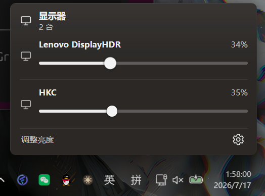
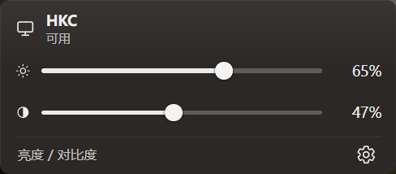
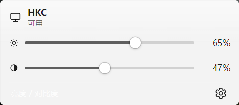
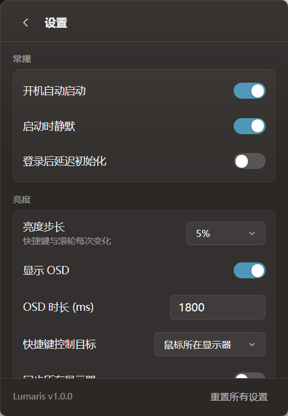

<p align="center">
  
</p>

<h1 align="center">Lumaris</h1>

<p align="center">
  <strong>Luma × Polaris</strong> — 为 Windows 打造的专业显示器亮度控制<br/>
  Fluent 视觉 · 托盘常驻 · 外接屏 DDC/CI · 笔记本 WMI 背光 · 多显示器
</p>

<p align="center">
  <strong>简体中文</strong>
  ·
  <a href="README.en.md"><strong>English</strong></a>
</p>

<p align="center">
  <a href="#下载"></a>
  <a href="https://github.com/Elnyxn/Lumaris/releases"></a>
  <a href="https://github.com/Elnyxn/Lumaris/releases"></a>
  <a href="#许可"></a>
  <a href="#平台"></a>
</p>

<p align="center">
  
  
  
  
</p>

---

## 产品亮点

| | 能力 | 说明 |
|:---:|:---|:---|
| 🔆 | **精准亮度** | 外接屏 DDC/CI（VCP 0x10）+ 标准亮度 API；笔记本内屏 WMI/ACPI 背光 |
| 🖥️ | **多显示器** | 上下堆叠一览调节；支持同步 / 独立目标 / 固定目标 |
| ⌨️ | **全局快捷键** | 可自定义组合键；长按加速度曲线，短按按设置步长 |
| 🖱️ | **托盘滚轮** | 悬停托盘图标滚轮即可调亮度，无需打开主界面 |
| 🎨 | **Fluent UI** | 深色 / 浅色主题，贴近 Windows 11 系统浮层体验 |
| 🌐 | **中英双语** | 界面与托盘文案完整 i18n |
| ⚡ | **轻量常驻** | 单实例托盘应用，低资源占用，开机自启可选 |

---

## 界面预览

<p align="center">
  <br/>
  <em>多显示器亮度浮窗</em>
</p>

<p align="center">
  
  &nbsp;
  <br/>
  <em>单屏 · 亮度 + 对比度 · 浅色模式</em>
</p>

<p align="center">
  <br/>
  <em>设置页面</em>
</p>

---

## 下载

从 [**GitHub Releases**](https://github.com/Elnyxn/Lumaris/releases) 获取最新版本：

| 包类型 | 文件 | 适用场景 |
|:---|:---|:---|
| **安装包** | `Lumaris-Setup-x.y.z.exe` | 推荐：开始菜单、卸载、可选开机自启 |
| **便携版** | `Lumaris-portable-x.y.z.zip` | 解压即用，不写安装目录 |

> 需要 **Microsoft Edge WebView2 Runtime**（Windows 10/11 多数机器已预装）。

发布页附带 `SHA256SUMS.txt`，下载后建议核对哈希。

---

## 快速开始

1. 安装 Setup 或解压 Portable  
2. 托盘区出现 **Lumaris** 图标  
3. **单击托盘** 打开亮度浮窗；**悬停滚轮** 直接调亮度  
4. 齿轮进入设置：快捷键、主题、语言、显示器别名等  

### 默认快捷键（可改）

| 动作 | 默认 |
|:---|:---|
| 提高亮度 | `Ctrl + Alt + ↑` |
| 降低亮度 | `Ctrl + Alt + ↓` |
| 显示/隐藏浮窗 | `Ctrl + Alt + B` |
| 上一台 / 下一台 | `Ctrl + Alt + ← / →` |

---

## 工作原理

```text
┌─────────────┐     ┌──────────────────┐     ┌─────────────────┐
│ 浮窗 / 快捷键 │ ──► │ 目标解析与缓存    │ ──► │ 后台 DDC Worker │
│ 托盘滚轮     │     │ 乐观 UI 更新     │     │ 串行写硬件       │
└─────────────┘     └──────────────────┘     └────────┬────────┘
                                                      │
                    ┌──────────────────┐              │
                    │ 外接屏 DDC/CI     │ ◄────────────┤
                    │ 笔记本 WMI 背光   │ ◄────────────┘
                    └──────────────────┘
```

- **外接显示器**：优先 `SetMonitorBrightness` / VCP `0x10`  
- **笔记本内屏**：`root\wmi` → `WmiMonitorBrightness` / `WmiSetBrightness`，并按硬件 InstanceName 匹配，避免「仅第二屏幕」时误绑外接屏  

---

## 技术栈

| 层 | 技术 |
|:---|:---|
| 应用壳 | [Tauri 2](https://tauri.app/) |
| 系统与硬件 | Rust · windows-rs · Win32 Monitor Configuration API · WMI |
| 界面 | TypeScript · Vite · 原生 HTML/CSS（无重型前端框架） |
| 运行时 | 单实例 WebView2 |

---

## 从源码构建

### 环境

- Windows 10 **1809+** / Windows 11  
- [Rust](https://rustup.rs/) 1.77+  
- [Node.js](https://nodejs.org/) 20+  
- Visual C++ Build Tools + Windows SDK（MSVC 本机包）  
- 或 WSL + `x86_64-pc-windows-gnu` 交叉编译（见 `docs/BUILD.md`）

### 开发

```bash
npm install
npm run tauri:dev
```

### 发布产物

```bash
npm run build
cd src-tauri && cargo build --release --target x86_64-pc-windows-gnu

./scripts/package-portable.sh
# Windows:
#   .\scripts\package-portable.ps1 -MakeInstaller
```

更多说明：[`docs/BUILD.md`](docs/BUILD.md) · [`docs/RELEASE.md`](docs/RELEASE.md) · [`docs/DDC.md`](docs/DDC.md)

---

## 配置与数据

| 路径 | 内容 |
|:---|:---|
| `%LOCALAPPDATA%\Lumaris\config.json` | 设置、快捷键、主题、语言 |
| `%LOCALAPPDATA%\Lumaris\logs\` | 滚动日志（保留最近 14 个文件） |

卸载安装包**默认保留**用户配置，便于重装后恢复偏好。

---

## 路线图

- [x] DDC/CI 外接屏亮度  
- [x] 笔记本 WMI 背光  
- [x] 多显示器堆叠 UI  
- [x] 深色 / 浅色 · 中英 i18n  
- [x] 托盘滚轮 · 快捷键加速度  
- [x] 应用内 GitHub 更新检测  
- [ ] 对比度等更多 VCP（按显示器能力）  
- [ ] 签名安装包 / 自动更新通道  

---

## 贡献

欢迎 Issue / PR。提交前建议：

```bash
npm run typecheck
npm run build
cargo check --target x86_64-pc-windows-gnu
```

---

## 许可

[**PolyForm Noncommercial 1.0.0**](LICENSE) © Elnyxn / Lumaris contributors

- ✅ 允许个人学习、研究、业余项目等**非商业**用途  
- ✅ 允许查看源码、修改（在许可证条款内）  
- ❌ **禁止商业使用**（含收费产品、SaaS、公司内部盈利性部署等，详见 LICENSE）  
- 说明：这不是 OSI 定义的 “Open Source”，而是 **Source Available（源码可见）**

如需商业授权，请联系仓库维护者。

---

<p align="center">
  <br/>
  <sub>Lumaris — 把亮度控制做回系统级体验</sub><br/>
  <a href="https://github.com/Elnyxn/Lumaris">github.com/Elnyxn/Lumaris</a>
  ·
  <a href="README.en.md">English</a>
</p>
